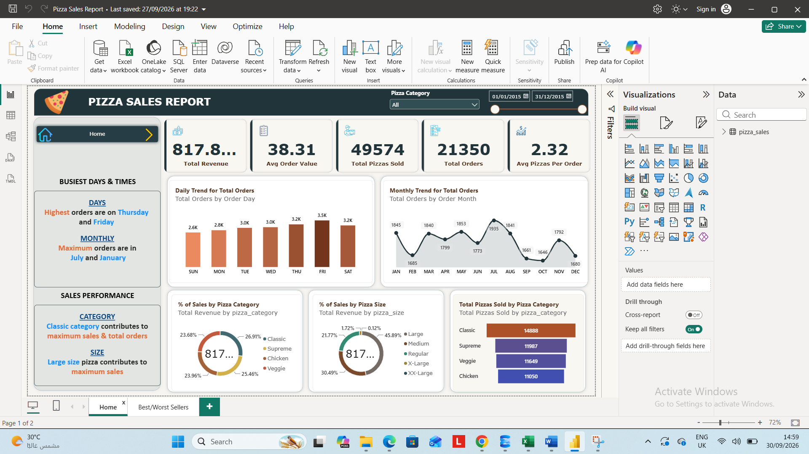
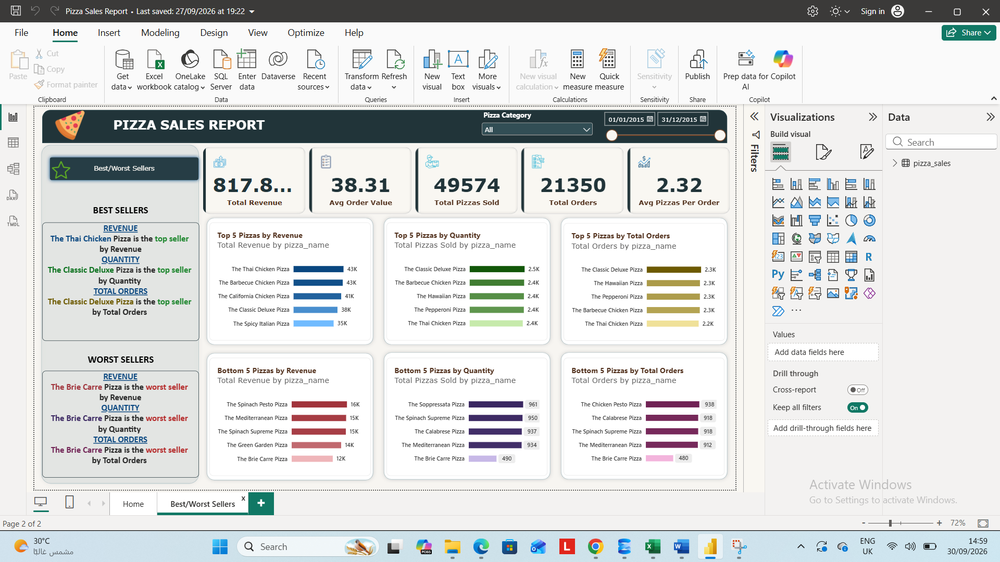

# 🍕 Pizza Sales Analysis

### SQL Server & Power BI | Data Analytics Portfolio Project

<p align="center">

**Turning raw pizza sales data into meaningful business insights using SQL and Power BI.**

</p>

---

## 📌 Project Overview

This project presents an end-to-end analysis of **pizza sales data** using **SQL Server** and **Microsoft Power BI**.

The main goal is to analyze sales performance, customer ordering behavior, product performance, and time-based sales trends in order to transform raw transactional data into clear and actionable business insights.

The project demonstrates practical skills in:

* SQL Data Analysis
* KPI Development
* Exploratory Data Analysis
* Data Aggregation
* Time-Based Analysis
* Business Performance Analysis
* Power BI Dashboard Development
* Data Visualization

---

# 🎯 Business Objective

The objective of this project is to answer important business questions related to pizza sales performance, including:

* How much revenue was generated?
* How many orders were placed?
* How many pizzas were sold?
* What is the average order value?
* How many pizzas are sold per order on average?
* When are the busiest ordering hours?
* Which pizza categories generate the most revenue?
* Which pizza sizes contribute the most to sales?
* Which pizzas are the best sellers?
* Which pizzas have the lowest sales performance?

---

# 🗂️ Dataset

The dataset contains pizza sales transactions from **2015**.

### Dataset Columns

| Column              | Description                                                      |
| ------------------- | ---------------------------------------------------------------- |
| `pizza_id`          | Unique identifier for the pizza record                           |
| `order_id`          | Unique order identifier                                          |
| `pizza_name_id`     | Identifier for the pizza type                                    |
| `quantity`          | Number of pizzas sold                                            |
| `order_date`        | Date of the order                                                |
| `order_day`         | Day of the order                                                 |
| `order_time`        | Time of the order                                                |
| `unit_price`        | Price of one pizza                                               |
| `total_price`       | Total price of the transaction                                   |
| `pizza_Regularize`  | Pizza size/standardized pizza attribute available in the dataset |
| `pizza_category`    | Pizza category                                                   |
| `pizza_ingredients` | Ingredients used in the pizza                                    |
| `pizza_name`        | Pizza name                                                       |

---

# 🛠️ Tools & Technologies

| Tool               | Purpose                                 |
| ------------------ | --------------------------------------- |
| 🗄️ **SQL Server** | Data analysis and KPI calculations      |
| 📊 **Power BI**    | Interactive dashboard and visualization |
| 📐 **DAX**         | Measures and analytical calculations    |
| 🔄 **Power Query** | Data preparation and transformation     |
| 📁 **Excel**       | Data source / supporting analysis       |

---

# 🔍 SQL Analysis

SQL Server was used to analyze the dataset and calculate the main business metrics.

The analysis includes several categories.

## 📊 Key Performance Indicators

### 1. Total Revenue

Calculates the total revenue generated from all pizza transactions.

```sql
SELECT 
    SUM(total_price) AS Total_Revenue
FROM pizza_sales;
```

### 2. Average Order Value

Calculates the average amount spent per order.

```sql
SELECT 
    CAST(
        SUM(total_price) / COUNT(DISTINCT order_id)
        AS DECIMAL(10,2)
    ) AS Avg_Order_Value
FROM pizza_sales;
```

### 3. Total Pizzas Sold

```sql
SELECT 
    SUM(quantity) AS Total_Pizzas_Sold
FROM pizza_sales;
```

### 4. Total Orders

```sql
SELECT 
    COUNT(DISTINCT order_id) AS Total_Orders
FROM pizza_sales;
```

### 5. Average Pizzas Per Order

```sql
SELECT 
    CAST(
        CAST(SUM(quantity) AS DECIMAL(10,2)) /
        CAST(COUNT(DISTINCT order_id) AS DECIMAL(10,2))
        AS DECIMAL(10,2)
    ) AS Avg_Pizzas_Per_Order
FROM pizza_sales;
```

---

# ⏰ Time-Based Analysis

## Hourly Trend

The hourly analysis identifies the number of pizzas sold during each hour of the day.

```sql
SELECT 
    DATEPART(HOUR, order_time) AS Order_Hour,
    SUM(quantity) AS Total_Pizzas_Sold
FROM pizza_sales
GROUP BY DATEPART(HOUR, order_time)
ORDER BY Order_Hour;
```

This analysis helps identify **peak ordering hours** and customer ordering patterns throughout the day.

---

## 📅 Weekly Order Trend

Weekly order volume was analyzed using ISO week numbers.

```sql
SELECT 
    DATEPART(ISO_WEEK, order_date) AS Week_Number,
    YEAR(order_date) AS Year,
    COUNT(DISTINCT order_id) AS Total_Orders
FROM pizza_sales
GROUP BY 
    DATEPART(ISO_WEEK, order_date),
    YEAR(order_date)
ORDER BY 
    Year,
    Week_Number;
```

---

# 🍕 Product & Sales Analysis

## Sales by Pizza Category

The percentage contribution of each pizza category to total revenue was calculated.

```sql
SELECT 
    pizza_category,
    CAST(SUM(total_price) AS DECIMAL(10,2)) AS Total_Revenue,
    CAST(
        SUM(total_price) * 100.0 /
        (SELECT SUM(total_price) FROM pizza_sales)
        AS DECIMAL(10,2)
    ) AS Sales_Percentage
FROM pizza_sales
GROUP BY pizza_category
ORDER BY Total_Revenue DESC;
```

---

## 📏 Sales by Pizza Size

Sales performance was analyzed according to pizza size/standardized size attribute.

```sql
SELECT 
    pizza_Regularize,
    CAST(SUM(total_price) AS DECIMAL(10,2)) AS Total_Revenue,
    CAST(
        SUM(total_price) * 100.0 /
        (SELECT SUM(total_price) FROM pizza_sales)
        AS DECIMAL(10,2)
    ) AS Sales_Percentage
FROM pizza_sales
GROUP BY pizza_Regularize
ORDER BY Total_Revenue DESC;
```

---

# 🏆 Top & Bottom Performing Pizzas

The project identifies the highest- and lowest-performing pizzas using three different business metrics.

### 💰 By Revenue

* Top 5 pizzas by revenue
* Bottom 5 pizzas by revenue

### 🍕 By Quantity

* Top 5 pizzas by quantity sold
* Bottom 5 pizzas by quantity sold

### 🧾 By Orders

* Top 5 pizzas by number of orders
* Bottom 5 pizzas by number of orders

This provides a more comprehensive view of product performance rather than relying on a single metric.

---

# 📊 Power BI Dashboard

The SQL analysis was transformed into an interactive **Power BI dashboard** designed to provide a clear overview of pizza sales performance.

### Dashboard KPIs

The dashboard presents key metrics such as:

* 💰 Total Revenue
* 🧾 Total Orders
* 🍕 Total Pizzas Sold
* 💵 Average Order Value
* 📦 Average Pizzas Per Order

### Dashboard Analysis

The dashboard focuses on:

* Sales trends
* Order trends
* Hourly ordering patterns
* Sales by pizza category
* Sales by pizza size
* Best-selling pizzas
* Worst-selling pizzas
* Revenue performance

---

# 🖼️ Dashboard Preview





# 🔄 Project Workflow

```text
                 RAW DATA
                    │
                    ▼
          DATA PREPARATION
                    │
                    ▼
              SQL SERVER
                    │
        ┌───────────┴───────────┐
        ▼                       ▼
   KPI ANALYSIS           SALES ANALYSIS
        │                       │
        └───────────┬───────────┘
                    ▼
              POWER BI
                    │
                    ▼
        DATA VISUALIZATION
                    │
                    ▼
           BUSINESS INSIGHTS
```

---

# 📁 Repository Structure

```text
Pizza-Sales-Analysis/
│
├── 📂 Dataset/
│   └── pizza_sales.csv
│
├── 📂 SQL/
│   └── Pizza_Sales_Analysis.sql
│
├── 📂 PowerBI/
│   └── Pizza_Sales_Dashboard.pbix
│
├── 📂 Dashboard/
│   └── Pizza_Sales_Dashboard.png
│
└── 📄 README.md
```

---

# 💡 Business Questions Answered

This project addresses the following questions:

### Sales Performance

* What is the total revenue?
* What is the average order value?
* How many pizzas were sold?
* How many orders were placed?

### Customer Behavior

* How many pizzas does a customer purchase per order on average?
* What are the busiest ordering hours?
* What are the weekly order patterns?

### Product Performance

* Which pizzas generate the highest revenue?
* Which pizzas generate the lowest revenue?
* Which pizzas are sold in the highest quantities?
* Which pizzas have the lowest quantities sold?
* Which pizzas appear in the highest number of orders?

### Category & Size

* Which pizza category contributes the most revenue?
* Which pizza size contributes the most revenue?

---

# 📈 Analytical Approach

The project uses multiple metrics to evaluate business performance rather than relying on a single KPI.

For example:

**Revenue** measures financial contribution.

**Quantity Sold** measures product demand.

**Total Orders** measures how frequently products are included in customer orders.

This allows product performance to be analyzed from different business perspectives.

---

# 🎓 Skills Demonstrated

Through this project, I demonstrated practical experience in:

### SQL

* `SELECT`
* `SUM()`
* `COUNT()`
* `COUNT(DISTINCT)`
* `GROUP BY`
* `ORDER BY`
* `TOP`
* `WHERE`
* Subqueries
* `CAST()`
* `DATEPART()`
* Time-based analysis
* KPI calculations

### Power BI

* Dashboard development
* KPI Cards
* Interactive visualizations
* Business-oriented reporting
* Data storytelling

### Data Analytics

* Exploratory Data Analysis
* Trend analysis
* Product performance analysis
* Revenue analysis
* Customer ordering behavior
* Business KPI development

---

# 🚀 Key Takeaways

The project demonstrates an end-to-end analytical workflow:

> **Raw Data → SQL Analysis → KPIs → Business Analysis → Power BI Dashboard → Insights**

The combination of **SQL and Power BI** allows the raw transactional dataset to be transformed into a structured analytical solution that can support business decision-making.

---

# 👨‍💻 Author

## Mahmoud Said

**Computer & Artificial Intelligence Graduate**

**Data Analyst | SQL | Power BI | Python**

📌 Interested in Data Analytics, Business Intelligence, and turning data into actionable insights.

---

⭐ **If you found this project useful, feel free to explore the repository and review the SQL analysis and Power BI dashboard.**

